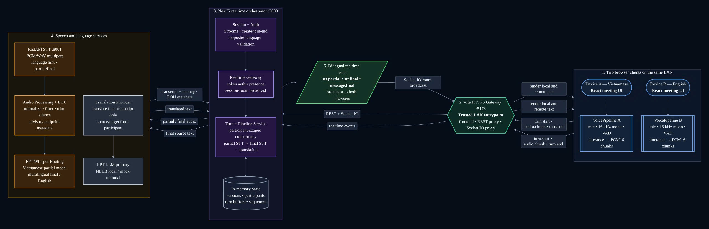

# VietBridge

> **[VietBridge PRD](./VietBridge_PRD_Demo_Ready.md)**
> Tài liệu yêu cầu sản phẩm mới sau expert review, tập trung vào demo scope, release gate, acceptance tests, và Critical Fact Guard.
>

> **[📖 Xem Hướng Dẫn Tích Hợp Chi Tiết (Integration Guide)](./docs/integration-guide.md)**
> Đọc hướng dẫn này để biết cách thiết lập, khởi chạy và test toàn bộ luồng âm thanh STT + Dịch thuật mới nhất trên FPT Cloud.
>
> **[🏗️ Xem Báo Cáo Kỹ Thuật & Kiến Trúc Hệ Thống (Technical & Architecture Report)](./ARCHITECTURE.md)**
> Báo cáo chi tiết gửi Ban Giám Khảo về kiến trúc luồng dữ liệu thời gian thực (Audio Pipeline, Silero VAD, FPT Whisper Turbo STT, Llama-3.3 Translation) cùng kết quả benchmark của hệ thống.

The project is organized as a monorepo containing a React frontend, a NestJS backend, and dedicated modules for voice processing, Speech-to-Text (STT), and translation.

## Key Features

- Create and join meetings using room codes.
- Authenticate participants and ensure that both sides use opposite languages.
- Support two-way Vietnamese–English conversations through the microphone.
- Detect speech with VAD and automatically segment utterances.
- Display partial and final transcripts in real time.
- Translate conversations and synchronize results through Socket.IO.
- Process both participants concurrently with participant-scoped pipelines.
- Use mock providers during development or connect to real STT and translation services.

## Architecture Overview



Main processing flow:

1. Two browsers run the React meeting interface and capture audio independently. Each `VoicePipeline` converts microphone audio to 16 kHz mono PCM, uses VAD to detect utterances, and splits the audio into PCM16 chunks.
2. The Vite HTTPS Gateway (`:5173`) acts as the trusted LAN entry point. It serves the frontend and proxies REST API and Socket.IO connections to the backend.
3. The NestJS backend (`:3000`) manages rooms, authentication, participant presence, and in-memory session data. The Realtime Gateway receives `turn.start`, `audio.chunk`, and `turn.end` events, while the Turn/Pipeline Service coordinates STT and translation independently for each participant.
4. The FastAPI STT service (`:8001`) accepts PCM/WAV audio, preprocesses it, and returns partial or final transcripts together with latency and End Of Utterance (EOU) metadata. Final transcripts are then sent to the configured translation provider.
5. The backend broadcasts `stt.partial`, `stt.final`, and `message.final` events to the Socket.IO room so both browsers can render the original text and translated result in real time.

## Technology Stack

- **Frontend:** React 18, TypeScript, Vite, Tailwind CSS, and Zustand.
- **Backend:** NestJS, Socket.IO, and Jest.
- **Voice:** Web Audio API, Silero VAD, and ONNX Runtime Web.
- **STT:** Python, FastAPI, and Whisper models hosted on FPT Cloud.
- **Translation:** FPT LLM or a mock provider; the repository also includes an NLLB-200 service for independent development and testing.

## Project Structure

```text
.
├── frontend/             # Meeting interface
├── backend/              # REST API, Socket.IO, and processing pipeline
├── voice/                # Audio capture, VAD, and audio transport
├── stt/                  # Speech-to-Text service
├── translation/          # LLM-based translation logic
├── translation-service/  # Local NLLB-200 translation service
└── docs/                 # Integration, deployment, and testing documentation
```

## Quick Start

### Prerequisites

- Node.js 20 or later and npm.
- Python 3.10 or later when running the STT or translation service.

### 1. Start the backend

Copy `backend/.env.example` to `backend/.env`, then run:

```bash
cd backend
npm install
npm run start:dev
```

The backend runs at `http://localhost:3000` by default and uses mock providers.

### 2. Start the frontend

Create `frontend/.env.local` with the following configuration:

```env
VITE_BACKEND_API_URL=http://localhost:3000
VITE_BACKEND_WS_URL=http://localhost:3000
VITE_PUBLIC_APP_URL=http://localhost:5173
VITE_SUPPORTED_LANGUAGES=vi,en
```

Then start the application:

```bash
cd frontend
npm install
npm run dev
```

Open `http://localhost:5173` in a browser. To test a two-person conversation, open two browser windows and join the same room.

By default, the backend uses mock STT and translation providers. This mode is suitable for testing the interface, room creation and joining flows, and real-time connectivity without an API key.

## Running with Real Services

The STT service runs on port `8001` by default:

```bash
cd stt
pip install -r stt_service/requirements.txt
python -m stt_service.server
```

Then set `STT_PROVIDER=remote` in `backend/.env`. When using FPT Cloud, store `FPT_API_KEY` in your local environment file and never commit the key to Git.

To use real translation, set `TRANSLATION_PROVIDER=remote` so the backend calls the FPT LLM. The `translation-service/` directory provides a standalone NLLB-200 service on port `8000`, but the `local` provider is not yet connected to the current backend. See `backend/.env.example` and the [Integration Guide](./docs/integration-guide.md) for the complete configuration.

When testing with two devices on the same LAN, browsers must access the application over HTTPS to obtain microphone permission. See the [LAN Deployment Guide](./docs/deploy.md) for certificate and Vite proxy configuration.

## Testing

```bash
# Backend
cd backend
npm run test
npm run test:e2e

# Frontend
cd frontend
npm run test
npm run build
```

## Related Documentation

- [VietBridge Demo Ready PRD](./VietBridge_PRD_Demo_Ready.md)
- [Integration Guide](./docs/integration-guide.md)
- [LAN Deployment Guide](./docs/deploy.md)
- [Audio Streaming Architecture](./docs/audio-streaming-contract.md)
- [Codebase Overview](./docs/CODEBASE_OVERVIEW.md)

> **Note:** Rooms, participants, and transcripts are currently stored in memory. This data is cleared when the backend restarts or the meeting ends.
