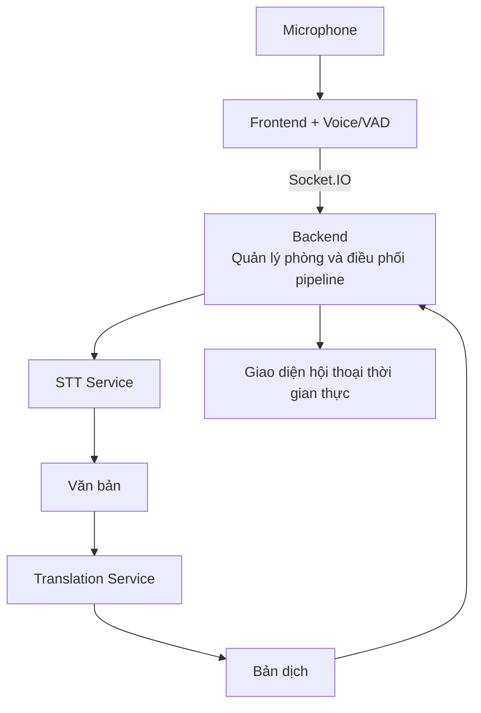

# VietBridge

VietBridge là ứng dụng web hỗ trợ hội thoại **Việt – Anh theo thời gian thực**. Người dùng có thể tạo hoặc tham gia phòng, nói bằng ngôn ngữ của mình và theo dõi nội dung được nhận dạng, dịch sang ngôn ngữ của người còn lại.

Dự án được tổ chức theo dạng monorepo, gồm giao diện React, backend NestJS và các module xử lý giọng nói, Speech-to-Text (STT), dịch thuật.

## Tính năng chính

- Tạo và tham gia phòng bằng mã phòng.
- Giao tiếp hai chiều Việt – Anh qua microphone.
- Phát hiện giọng nói (VAD) và tự động chia câu nói.
- Hiển thị transcript tạm thời và hoàn chỉnh theo thời gian thực.
- Dịch nội dung hội thoại và đồng bộ cho các thành viên qua Socket.IO.
- Hỗ trợ provider mock để phát triển, hoặc kết nối dịch vụ STT/translation thật.

## Kiến trúc tổng quan



## Công nghệ sử dụng

- **Frontend:** React 18, TypeScript, Vite, Tailwind CSS, Zustand.
- **Backend:** NestJS, Socket.IO, Jest.
- **Voice:** Web Audio API, Silero VAD, ONNX Runtime Web.
- **STT:** Python, FastAPI, FPT Cloud/Groq tùy cấu hình.
- **Translation:** FPT LLM hoặc NLLB-200 chạy local.

## Cấu trúc thư mục

```text
.
├── frontend/             # Giao diện phòng họp
├── backend/              # REST API, Socket.IO và pipeline xử lý
├── voice/                # Thu âm, VAD và truyền audio
├── stt/                  # Dịch vụ chuyển giọng nói thành văn bản
├── translation/          # Logic dịch qua LLM
├── translation-service/  # Dịch vụ dịch local bằng NLLB-200
└── docs/                 # Tài liệu tích hợp, triển khai và kiểm thử
```

## Bắt đầu nhanh

### Yêu cầu

- Node.js 20 trở lên và npm.
- Python 3.10 trở lên nếu chạy STT hoặc translation service.

### 1. Chạy backend

Sao chép `backend/.env.example` thành `backend/.env`, sau đó:

```bash
cd backend
npm install
npm run start:dev
```

Backend mặc định chạy tại `http://localhost:3000` và sử dụng provider mock.

### 2. Chạy frontend

Tạo `frontend/.env.local`:

```env
VITE_BACKEND_API_URL=http://localhost:3000
VITE_BACKEND_WS_URL=http://localhost:3000
VITE_PUBLIC_APP_URL=http://localhost:5173
VITE_SUPPORTED_LANGUAGES=vi,en
```

Sau đó khởi động ứng dụng:

```bash
cd frontend
npm install
npm run dev
```

Mở `http://localhost:5173` trên trình duyệt. Để kiểm tra hội thoại hai người, có thể mở hai cửa sổ trình duyệt và tham gia cùng một phòng.

## Chạy với dịch vụ thật

STT service chạy mặc định ở cổng `8001`:

```bash
cd stt
pip install -r stt_service/requirements.txt
python -m stt_service.server
```

Sau đó đổi `STT_PROVIDER=remote` trong `backend/.env`. Khi sử dụng FPT Cloud, đặt `FPT_API_KEY` trong file môi trường cục bộ và không commit khóa lên Git.

Translation có thể dùng FPT LLM qua cấu hình backend hoặc chạy local service NLLB-200 ở cổng `8000`. Xem hướng dẫn chi tiết trong [Integration Guide](./docs/integration-guide.md).

## Kiểm thử

```bash
# Backend
cd backend
npm run test
npm run test:e2e

# Frontend
cd frontend
npm run test
npm run build
```

## Tài liệu liên quan

- [Hướng dẫn tích hợp](./docs/integration-guide.md)
- [Triển khai trong mạng LAN](./docs/deploy.md)
- [Kiến trúc audio streaming](./docs/audio-streaming-contract.md)
- [Tổng quan codebase](./docs/CODEBASE_OVERVIEW.md)

> **Lưu ý:** Trạng thái phòng, người tham gia và transcript hiện được lưu trong bộ nhớ. Dữ liệu sẽ mất khi backend khởi động lại hoặc phiên họp kết thúc.
